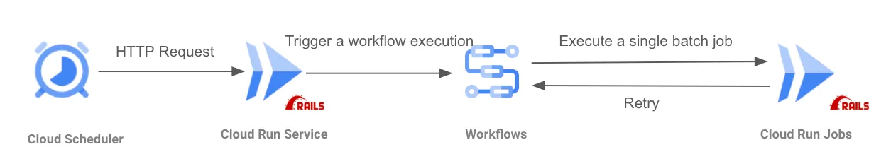
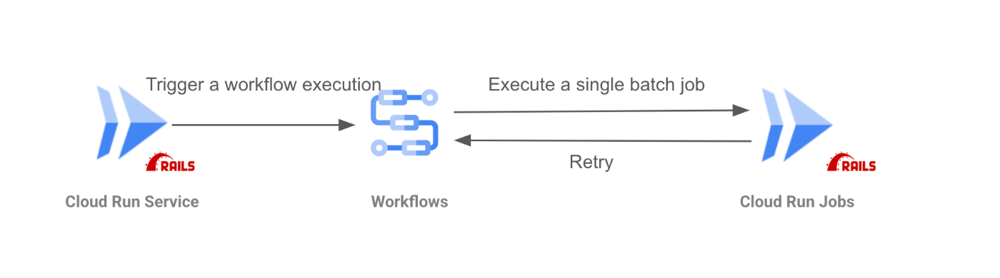
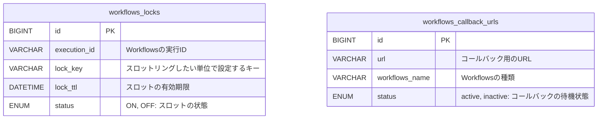
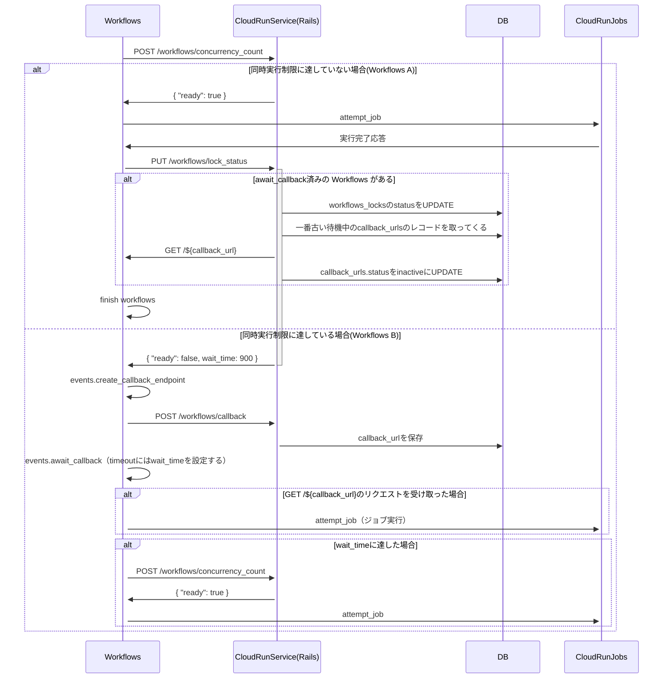

 <h1>職務経歴書</h1>

## 基本情報
- 氏名: 越智 翔一(オチ ショウイチ)
- 生年月日: 1997年11月18日
- 連絡先: dekamintv@gmail.com
- 仕事用GitHubリンク: https://github.com/sho-work
- プライベート用GitHubリンク: https://github.com/kakeru-one
- zennのプロフィール： https://zenn.dev/ochi_shoichi
- qiitaのプロフィール： https://qiita.com/dekamintv

## 職務経歴

### イタンジ株式会社(GA technologiesから出向) / イタンジ管理クラウド
- 在籍期間: 2022年4月 - 2024年8月
- 職種: フルスタックエンジニア
- 担当業務:
  - フロントエンド・バックエンドの設計・実装
  - タスクの割り振りやチームのプロジェクトのスケジュール管理などのチームマネジメント
- 使用技術:
  - 言語: Ruby, TypeScript
  - フレームワーク: Ruby on Rails, Next.js
  - データベース: MySQL
  - インフラ: AWS(Route53, CloudFront, S3, ELB, ECS Fargate, RDS,CloudWatch), terraform
  - その他: Docker, GitHub，JIRA，Slack, GitHub Action, CircleCI

### GMOビューティ株式会社 / キレイパスコネクト
- 在籍期間: 2024年9月 - 現在
- 職種: フルスタックエンジニア
- 担当業務:
  - インフラ周りの設計・導入
  - フロントエンド・バックエンドの設計・実装
- 使用技術:
  - 言語: Ruby, TypeScript
  - フレームワーク: Ruby on Rails, Next.js
  - データベース: MySQL
  - インフラ: Google Cloud(Cloud Run, Firestore, Cloud Pub/Sub, Big Query, Cloud Functions)
  - その他: Docker, GitHub，Slack, GitHub Action

## スキルセット
- 言語: Ruby, TypeScript
- フレームワーク: Ruby on Rails, Next.js
- データベース: MySQL
- その他の技術: Docker, GitHub，JIRA，Slack, GitHub Action, terraform

## 学歴
- 学校名: 九州工業大学
- 学部・学科: 工学部・電気電子工学科
- 学位: 学士
- 在学期間: 2017年4月 ~ 2022年3月

## その他
- 趣味・興味: オープンソースへの貢献, ISUCON

## 自己PR(現在所属している会社で遂行したことや、自身の強み)
<!-- ここに自己PRを記述します。経歴やスキルだけでなく、自分の強みや価値観、チームでの役割などをアピールする -->
チームの当たり前の基準をあげることを意識していました。
例えば、使っているライブラリのリリースノートを読むことを習慣化するように促したり、実際に自分がライブラリのリリースノートを読んで最新のライブラリの機能を使うように提案したりしました。
（e.g. steepというgemのType Assertion機能をチームで使うように促しました。）
また、課外活動として、以下のことを行いました。
### OSS活動
- issue: sds/mock_redis#292
- Pull Request: sds/mock_redis#299

### 他の会社との合同LT会で登壇
- 株式会社ワンキャリア様との合同LT会で登壇しました。内容としては、OSSコントリビュートを広めるための内容です。
  - 発表した証拠となるXでのツイート
    - 「OSSコミットしたら開発が楽しくなった話」と言うタイトルで発表しました。
    - https://x.com/itandi_biz/status/1774977260887659005?s=20

# 職務経歴の詳細 / GMOビューティ株式会社（キレイパスコネクト）
## メモリ使用量が多いSidekiqのジョブを別の実行基盤に移行しました

### 背景
当初、**メモリ使用量が多いバッチ処理** は **Sidekiq** を用いて実行していましたが、以下の課題が発生しました。

1. **メモリ使用量の問題**
   - `ある日付の特定の時間に対する空き枠`などの数十億を超えるレコード数のテーブルを更新処理するジョブの増加により、Sidekiqを実行するRailsアプリケーションのメモリ使用量が増大していた。
   - 一部のジョブは Sidekiqのメモリ制限を超え、OOM Killerによってプロセスが強制終了されることがあった。
    - 無料版のSidekiqをマルチスレッド環境下で動かしていたので、プロセスがクラッシュした場合には同一プロセス内の処理中のメッセージはすべて失われてしまっていた。
   - 上記で述べたメモリ使用量が大きいジョブの実行が失敗することによって、その結果を待つユーザーをかなり待たせることになってしまっていた。

2. **Sidekiq-Pro のコスト**
   - OOM Killerによって強制終了されたRedisのキューがジョブが完了するまで削除されないように、**Sidekiq-Pro（$99/月 ≒ 約15,000円）** の導入を検討したが、組織にとってはコストが高く、尚且つジョブの成功結果を待つユーザーの待ち時間は解消できなさそうだった。

このような背景から、**Sidekiq以外の基盤でバッチ処理を実行する仕組み** を検討しました。

---

### システム構成
Sidekiqを用いた非同期処理を、ユーザーの操作を起因とするEvent-Drivenな処理と、定期実行されているSchedule-Drivenな処理に分けてそれぞれ移行しました。

### Schedule-Driven な処理の移行
#### システム構成図
簡略化すると以下のようなシステム構成になります。エラー通知にはCloud Run Functionsを用いていますが、割愛しています。

#### 概要
- **ジョブのスケジュール実行**
  1. Cloud Scheduler が Cloud Run ServiceのRailsのエンドポイントに対して、HTTPリクエスト を定期実行
  2. Cloud Run ServiceのRailsのエンドポイント内でGoogle Cloud Workflowsを実行する
  3. Google Cloud Workflows のステップ内で Cloud Run Jobs を実行する

### Event-Driven な処理の移行
#### システム構成図
簡略化すると以下のようなシステム構成になります。エラー通知にはCloud Run Functionsを用いていますが、割愛しています。

#### 概要
- **ジョブの実行トリガー**
  - RailsアプリケーションからGoogle Cloud Workflowsをトリガーする
  - Google Cloud Workflows のステップ内で Cloud Run Jobs を実行する
- **同時実行数制御（スロットリング）**
  - **DB にスロット情報を保存** し、 **Cloud Run Jobs の同時実行数を制御**
  - Google Cloud Workflows から `POST /workflows/concurrency_count` を叩き、スロットに空きがあるかを判定
  - **スロットが埋まっている場合、待機中のWorkflowsがFIFOで実行されるように制御**
- **リトライ間隔制御**
  - Workflows 内で `POST /workflows/retry_intervals` を叩き、動的にリトライ間隔を調整
  - 時間経過ごとにリトライ間隔を動的に設定できる設計にしました。
    - e.g. 指数バックオフ

### エンドポイントと使用するテーブルの説明

| API | 説明 |
| --- | --- |
| `POST /workflows/callback` | 作成したcallback URLをDBに保存する。 |
| `PUT /workflows/lock_status` | 実行が終わったジョブのスロット解放処理（Workflows の完了時に実行）|
| `POST /workflows/concurrency_count` | 同時実行数確認に使用する。 |

#### 工夫したところ
スロットリングにおいて、同時実行するユーザーが1000人以上いたとしても、同時実行数の制限によって待たされる時間が最小限になるようなフローを設計しました。
WorkflowsとRailsサーバー間のポーリングに同時実行数の空き状況の確認ではなく、`events.await_callback`を用いたのはコスト削減のためです。
（Workflowsの料金はステップ数によって従量課金されるため。）
詳細は以下の通りです。

---

#### 結果
- OOM Killerによって途中で強制終了するジョブが限りなく少なくなりました。
  - メモリ使用量が多いもしくは長時間の重いジョブは新しい実行基盤、メモリ使用量があまり多くないかつ短時間のジョブはSidekiqで実行するようにすることで、ジョブ実行の安定性とリソースの最適化が実現できました。
- ランニングコストの削減
  - Sidekiq-Proの $150/月 のコストがかかるところを$10程度に抑えることができました。

<!-- 検討したこと -->
<!-- そもそものレコード数を減らすための -->
<!-- https://user-first.ikyu.co.jp/entry/2024/03/28/115631 -->

# 職務経歴の詳細 / イタンジ株式会社（家主情報管理アプリケーション新規開発）
## 概要
不動産管理会社向けの家主情報管理アプリケーション開発を行いました。
プロジェクトの開始時は、顧客に提供しておらず、不完全な状態で受け渡されたので、新規開発という位置付けになるかと思います。

## 技術スタックの詳細
- バックエンドはRuby on Railsで、モジュラモノリスになっていました。
- フロントエンドは、Next.jsを用いていました。（AWS Cloud FrontからS3に存在する静的ファイルを配信する方式だったのでSSRではなく、SSGでした。）

## メンバー
要員数：3名
PM：1名
エンジニア：2名

## 担当業務
- レビュー
  - バックエンド・フロントエンドともに相互レビュー
- 基本設計
- 詳細設計
- チームのタスク管理（メンバーへのタスクのアサイン・プロジェクト管理も含む）
- プログラムコーディング
  - フロントエンド
  - バックエンド
  - シェルスクリプト
  - CIの拡張
- リリース作業

### 家主の住所情報を別テーブルに移行する計画を立てて実行
【概要】
- 家主の住所情報を別テーブルに移行する計画を立てて実行しました。
  - 所属しているプロダクトで、既存のテーブルを正規化した前例がなかった状態で行いました。

【課題・問題点】
- 家主情報を表すテーブルがあったのですが、そのテーブルの中で以下のような構造で住所情報を持っていました。
  - address1_zipcode
  - address1_state
  - address1_city
  - address1_town
  - address1_other
  - address2_zipcode
  - address2_state
  - address2_city
  - address2_town
  - address2_other
  - address3_zipcode
  - address3_state
  - address3_city
  - address3_town
  - address3_other
- したがって、以下の問題点がありました。
  - 住所で検索したいときに、他のカラムの検索条件でindexを使用するので、適切にindexを効かせられない。（複合indexを使うにしても、その数だけ複合indexが増えてしまう。）
  - 住所情報の拡張のしにくさがある。

【どのように解決したか？】
- 家主の住所情報のカラムを、住所テーブルを作成し、その中に移行するようにしました。
  - `owners has_many owner_addresses`のようなリレーションです。
- 既存のデータが存在していたので、以下のような手順で行いました。
  1. owner_addressテーブル・モデルの作成をする。
  2. 各ユースケースの書き込み処理を、既存の住所カラムへの書き込みは残したままowner_addressにも書き込むようにする。
  3. バックフィル用のrakeタスクを作成して、既存のowners.address_1 ~ owners.address_3のカラムの情報を、owner_addressesテーブルに移行する。
  4. 家主の住所情報を参照するAPIのレスポンスを返す際に、owner_addressを経由して参照するようにする。
  5. ignore_columnし、各ユースケースの、address1_zipcodeへの書き込みをしている実装を消す。
  6. owners.address_1 ~ owners.address_3のカラムを全て削除する。

### バックエンドのテストカバレッジを90%まで向上
【概要】
- バックエンドのテストカバレッジを90%まで向上させました。

【課題・問題点】
- バックエンドのCIとしてテストを実行していたが、そもそもテストカバレッジが低かった（既存のテストカバレッジが50%程度だった）ので、不具合があったとしてもCIで気付けない状態でした。

【使用した技術】
- バックエンドの単体テストはRspecを用いていました。

【どのように解決したか？】
- テストを追加する習慣がなかったので、以下のことをチーム・個人として実行しました。
  - チームとして、テストを追加するタスクを作って、それに時間をかけるようにした。
  - 個人として、実装している箇所の関連する実装のテストが存在しない場合は、テストを必ず追加するボーイスカウトの精神を持つようにした。

【成果】
- これによって、不具合の遭遇確率を大幅に減らすことができました。

### オンボーディングを容易にできるようにドキュメントを整備
【概要】
- オンボーディングを容易にできるように、リポジトリ内のドキュメントを整備しました。

【課題・問題点】
- チームに新しく入ってきた人が素早く開発に入れるような状況ではなかった。

【どのように解決したか？】
- バックエンドの仕様を簡単に把握できるように、Open APIを全てのAPIに対して作成しました。
- ログイン機構が複雑なので、解説したドキュメントを作成しました。
- データ取り込み作業で発生する手順を手順書としてまとめました。
- 開発環境についてまとめたドキュメントを作成しました。
- モジュラモノリスでテストの実行方法が特殊だったため、テスト実行の手順書を書き、リポジトリに配置するようにしました。

【成果】
- 今までチームに新しく入ってきた人が開発に入るまでに3週間程度かかっていましたが、1週間程度で開発に参加できるようになりました。

### ナレッジをドキュメントにまとめることによるチームの生産性の向上
【概要】
- ナレッジをドキュメントにまとめることによるチームの生産性が向上しました。

【課題・問題点】
- 経験の浅いメンバーとシニアメンバーの間で技術力に大きな差があり、チームで議論する際に経験の浅いメンバーが議論に参加できていませんでした。

【どのように解決したか？】
以下のドキュメントを作成し、シニアメンバーにレビューいただいた上でチームに共有しました。
- クエリチューニングの方法をドキュメント化しました。
  - index keyをカラムに貼る時のベストプラクティス
  - `EXPLAIN`や`EXPLAIN ANALYZE`の出力結果の見方をドキュメント化しました。
  - N+1問題を解消するための方法
- 使っている以下のようなライブラリの使い方でつまづいた点をドキュメント化しました。
  - steep, RBS
  - packwerk
- sshポートフォワーディングを用いたdumpの取り方・リストア方法を手順として記したドキュメントを作成しました。

【成果】
- 以下を取り組んだことで、新卒一年目のメンバーでも品質の高いコーディングやレビューができるようになり、チーム全員の生産性をあげました。

### フロントエンドで繰り返し書く同じようなコンポーネントを共通化することを提案し、実行
【概要】
- フロントエンドで繰り返し書く同じようなコンポーネントを共通化することを提案し、実行しました。

【課題・問題点】
- テーブルの要素やページネーション、フォームなどに関する、同じようなCSSやJSXを用いたコンポーネントを何度も書いていました。
  - これによって、コンポーネントが複雑になりがちになっていたり、1ページ実装するのにかなり時間がかかっていました。

【どのように解決したか？】
- 一定の単位で共通化して再利用性を高めました。
- 社内UIライブラリにissueを立てて、UIコンポーネントを提供してもらえるように依頼しました。

【成果】
- 同じようなフォームやテーブル要素を実装したとしても、デザインの差異が生まれることがなく、かつ開発工数を半分程度に短縮することができました。

### ファイルアップロード機能のテストのために、CI環境でも同程度の環境を用意できるように拡張しました
【概要】
- ファイルアップロード機能のテストのために、CI環境でも同程度の環境を用意できるように拡張しました。

【課題・問題点】
- ファイルアップロード機能では、テスト環境以外ではストレージとしてAWSのS3を用いていましたが、テスト環境ではrailsプロジェクト配下にファイルがアップロードされるようになっていました。
  - これによって、「テスト環境とそれ以外の環境での差異が生まれてしまい、テストの信頼性が低い」と言う問題がありました。

【どのように解決したか？】
- Amazon S3と互換性があるMinIOというストレージをCI・テスト環境でも立ち上げるようにし、アプリケーションコードを本番同様の環境でテストできるようにしました。

【成果】
- 今までモックしていたテストが本番同様の環境で実行されるので、テストの信頼性が高くなりました。

